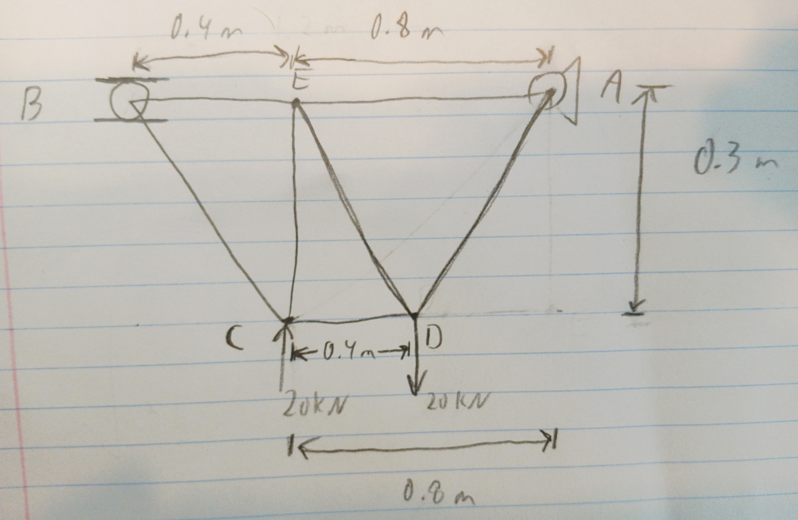
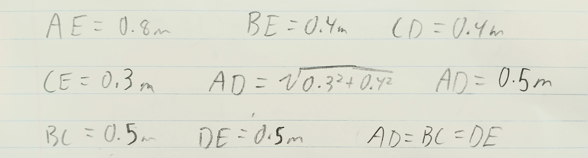
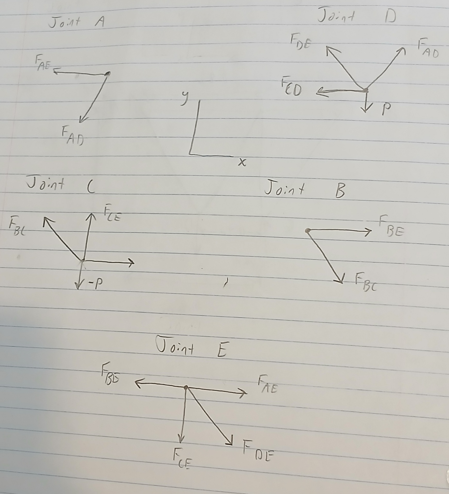

# A2 – Truss Stress Analysis

## Objective
This project entails creating a lightweight planar truss, analyzing all joints and pins, and determining the necessary size of all parts.

## Analyze
  
This is the image used to create a Truss. There are two applied loads, one at C applied upwards and one at D applied downwards. Point A is a pin and Point B is a roller. P represents a load of 20kN, a is a distance of 0.4m, and b is a distance of 0.3m.

## Decide
  
This is the rough geometry I created for the truss. The applied loads were put at joints to maximize the compression and tension in beams instead of creating a moment. Point E was added as an attempt to distribute the load more between points B and A. 

  
These are the calculated lengths for the beams. Most of the lengths were the given lengths of 0.4 meters or 0.3 meters, except for AE which was 0.8 meters (two of the 0.4 dimensions). The three diagonal beams were all 0.5 meters, they were found using the Pythagorean Theorem.

  
I created free body diagrams for all the joints within the truss.

## Communicate

