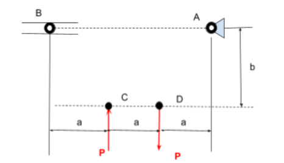

# A2 – Truss Stress Analysis

## Objective
This project entails creating a lightweight planar truss, analyzing all joints and pins, and determining the necessary size of all parts.

## Analyze

## Decide
![Truss Rough Sketch]

## Communicate

