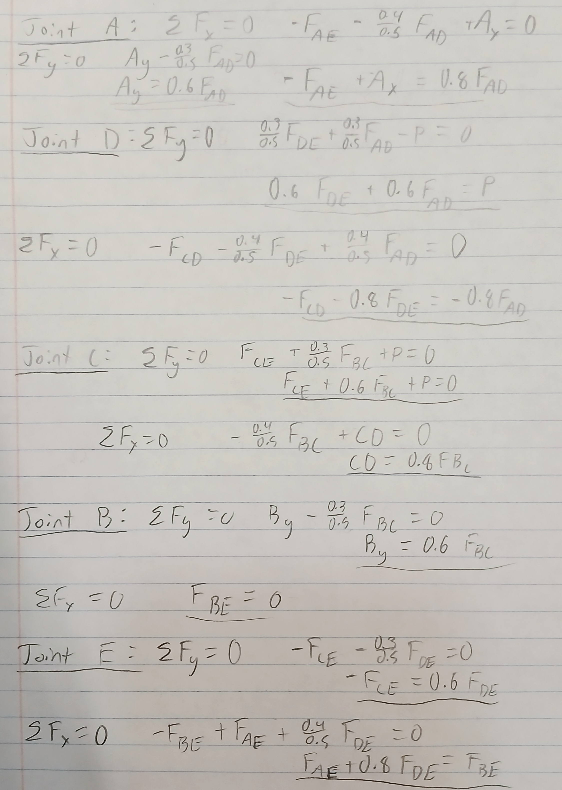
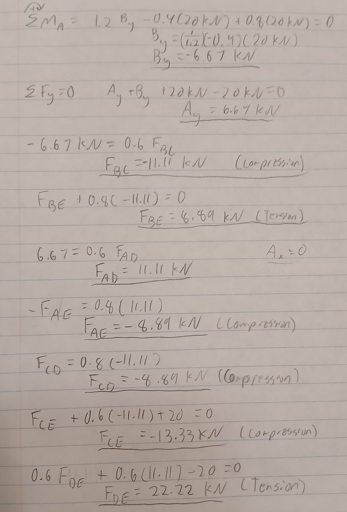
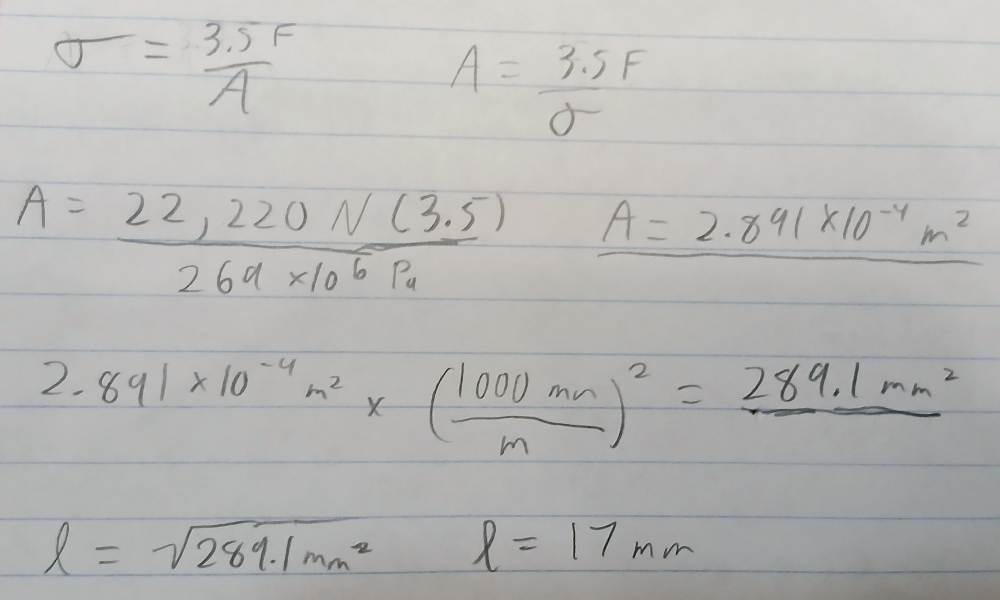
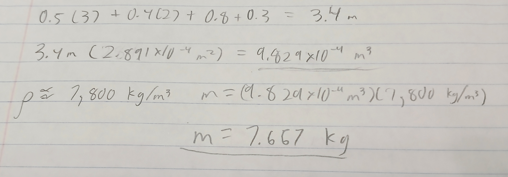
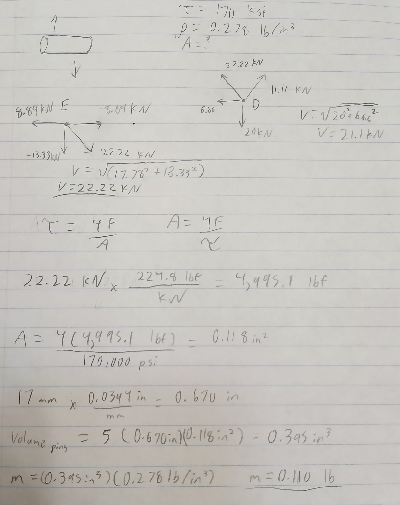

# A2 – Truss Stress Analysis

## Objective
This project entails creating a lightweight planar truss, analyzing all joints and pins, and determining the necessary size of all parts.

## Analyze

  
This is the image used to create a Truss. There are two applied loads, one at C applied upwards and one at D applied downwards. Point A is a pin and Point B is a roller. P represents a load of 20kN, a is a distance of 0.4m, and b is a distance of 0.3m.

## Decide

### Truss Design

  
This is the rough geometry I created for the truss. The applied loads were put at joints to maximize the compression and tension in beams instead of creating a moment. Point E was added as an attempt to distribute the load more between points B and A. 

  
These are the calculated lengths for the beams. Most of the lengths were the given lengths of 0.4 meters or 0.3 meters, except for AE which was 0.8 meters (two of the 0.4 dimensions). The three diagonal beams were all 0.5 meters, they were found using the Pythagorean Theorem.

  
I created free body diagrams for all the joints within the truss.

  
This is the symbolic solution of all internal forces in the in the x and y directions. It's based on the free body diagrams. The terms 0.3/0.5 and 0.4/0.5 are used because they are equivalent to sines and cosines of the truss angles. There was also a mistake in this math, BE = 0.8BC.

  
These are all of the calculated internal forces, the order is different because I had to calculate the moment in the corners and worked inwards.

### Calculating Cross Sectional Area
The largest force is 22.22kN of tension in beam DE. The necessary cross sectional is unknown, it will be calculated using a safety factor of 3.5. The yield strength of square A500 steel is around 269 MPa at the minimum.

  
This is the set up and calculations to determine the area needed for the truss beams. I multiplied the force by 3.5 to implement the safety factor, then after calculating the area I converted it from meters to millimeters.
Since I'm using the yield strength of a square, I then took the square root of the area since both sides are the same length.

  
I calculated the total length of all beams, then multiplied them by the area to get the total volume of all beams. I then looked up the density and multiplied it by the volume to get the total weight of the beams, 7.667 kg.

### Connecting Pins

The pins within the truss are all to be made with hardened tool steel with a yield strength of 170 ksi and density of 0.278 lb/ cubic inch.

  
I found the pin with the most shear stress by looking at both sides of the beam with the most internal stress. The shear of that pin was then multiplied by four as a safety factor and converted to imperial units. I found the are to be 0.118 inches squared and the weight of all five pins to be 0.110 pounds.

### CAD Truss
I modeled the truss as a single piece in Creo.

  
This was a basic sketch, getting the correct angles on the diagonal beams took time. I hadn't used Creo in a while and this was a good way to relearn it, dimensions can be tricky.
  
This was the completed sketch.
  
This is the extruded object. It was extruded to 17mm, matching the beam width. The mass Creo calculated was 7.410 kg, slightly under my calculation of 7.667 kg.

## Communicate

### Lessons Learned
This is the most detailed project my academic career has required. The content was mainly a review, besides designing the truss, the most improvement I had was in optimizing my workflow. All prior problems I've had were only analyzing a truss, not creating one. This project had me brainstorming, computing lengths and stresses, then taking pictures and embedding them. I was eventually able to lock in and work at a steady state. 

### Failure
