# A3 – Parametric Design and Finite Element Analysis

## Objective
The purpose of this project is to parametrically design a bar in CAD software, then apply a distributed load. The bar will also be subjected to finite element analysis.  
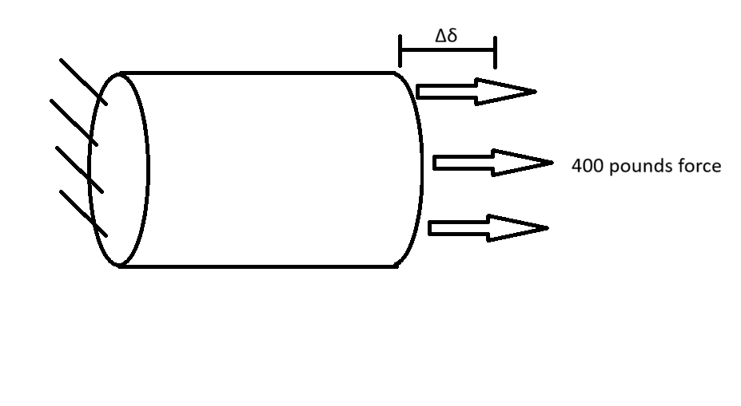

## Analyze
The parameters for the bar have the maximum axial deflection at .009 inches. It's designed from aluminum 6061 and the Young's Modulus will be 10 * 10^6 psi. The axial deflection is the same as the elongation of the bar. I'm using the maximum axial deflection and area to calculate how long the bar can be.

### Bar Design

The bar will be 0.5 inches wide and 0.6 inches tall, this makes the area 0.3 square inches. I tried using small, simple numbers to make math easy and lower length.
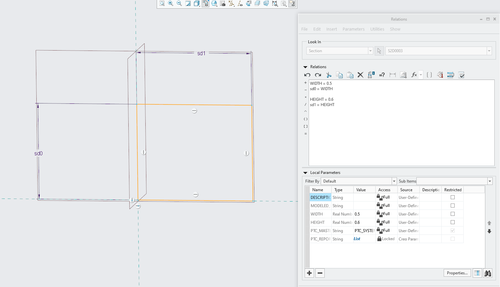  
I couldn't figure how to change Creo's generated variables directly so I simply set them equal to named variables. The length of the bar will be determined based on the direct tension elongation equation.
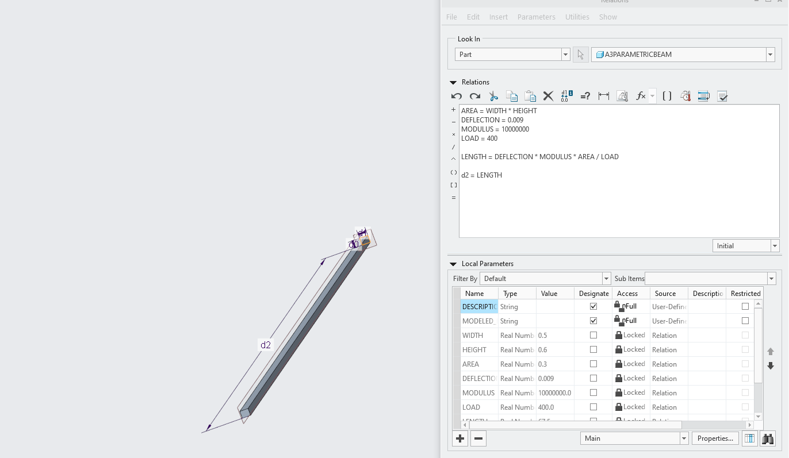  

The software calculated the length to be 67.5 inches.
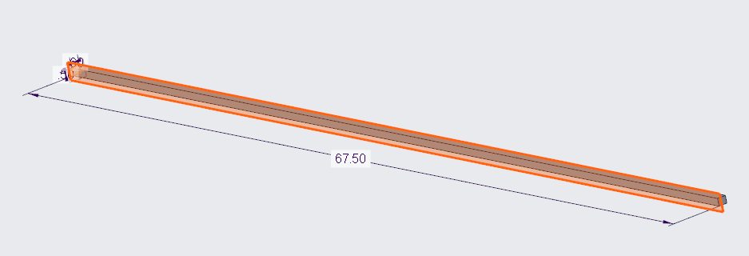  

I then set the material of the object to aluminum and modified the Young's Modulus to match aluminum 6061, the one in my calculations.
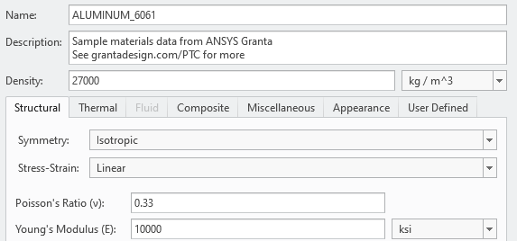  

This is the link to the CAD file : <a href="https://github.com/DillonK-spec/megr2157-portfolio/blob/main/docs/assignments/A03/a3parametricbeam2.prt" download>Download File</a>

### Simulations

I fixed one end of the beam and added a 400 pound force to the other end. The force acted in the same direction as the length.
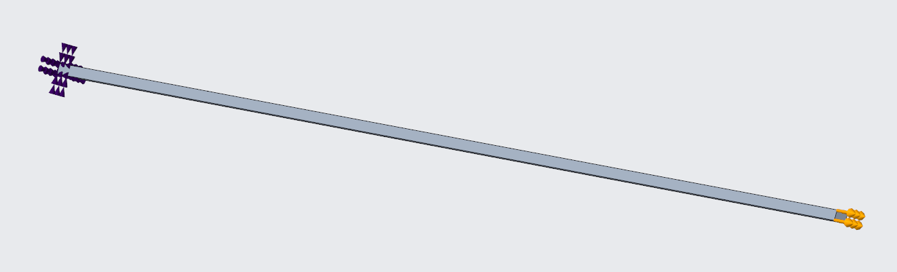  
This is the deformation simulation in Creo. The sum of the deformation was 0.009005, slightly exceeding the calculated deformation of 0.009
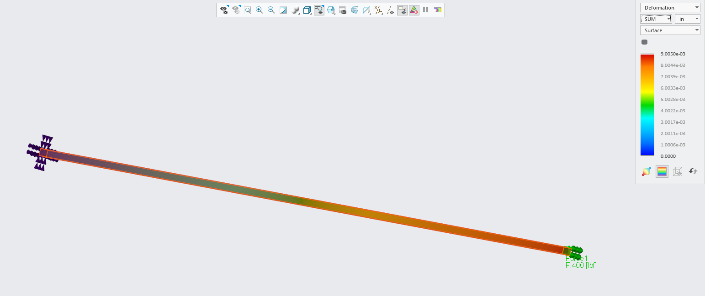  
Here I ran the Von Mises stress simulation and it had a value of 1.5991 ksi.
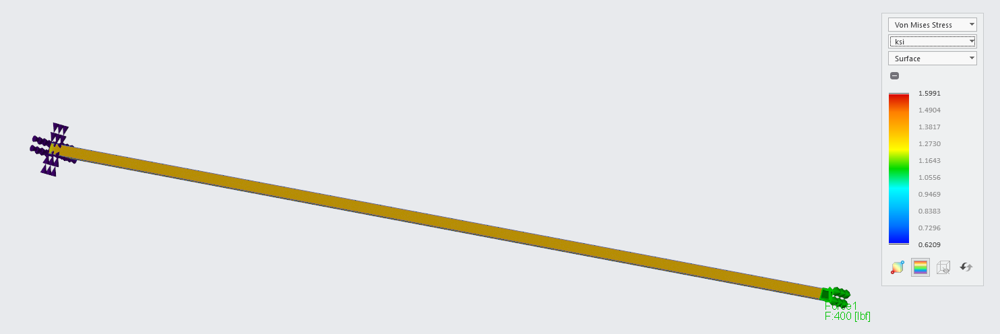  
The maximum stress calculated was 1.8491 ksi.
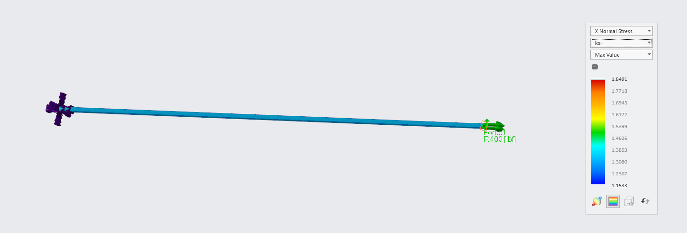  
The yield strength of aluminum is 40ksi, making this beam have a safety factor of 21.63.

## Decide
### Calculation Differences

The deflection value that was hand calculated was 0.009in and the one that came from creo was 0.009005in. The percent difference was 0.0556%. I would trust the hand calculation more because I'm not entirely sure what Creo's process was.  
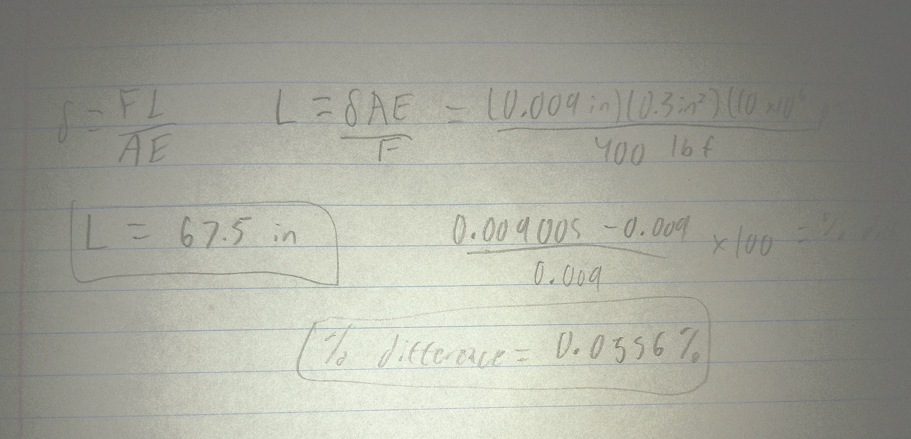
If a substantial hole was created in the bar, I will assume the diameter is half the width, so 0.25 inches. The diameter over width would be 0.5 and Kt would be 2.16, this would be multiplied by 1.599 and come out as 3.45 ksi. This is still well below the yield strength, but lowers the safety factor.

## Communicate
### Modifying Design Parameters
I will modify the length and width both to 0.1 in, then increase the load to 500 pound of force. I believe this will cause a decrease in the length.
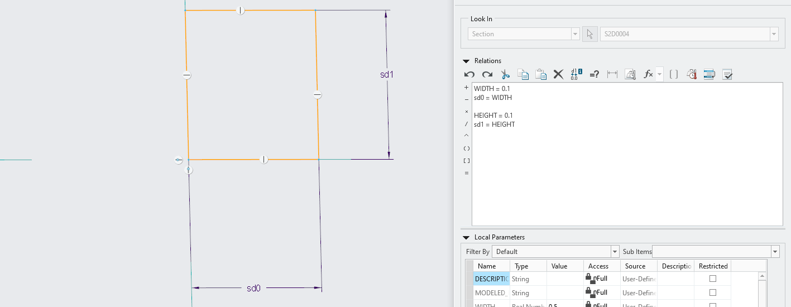  
This did cause length to shrink quite a bit, it went from 67.5 inches to 1.8 inches.
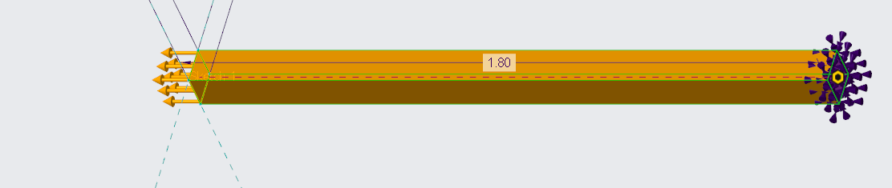  

### Reflection

This project was my first experience running simulations in Creo and setting up an FEA. I had trouble configuring the material in Creo and setting variable names, but I worked around it by setting generated variables equal to named variables. This assignment took around 4 and a half hours from start to finish. 
