# A4 – Motor Mount Design

The objective of this project is to design a motor mount based on calculated stress and deflection. It contains a brushed 24V gear motor with a 99.5:1 gearbox. 

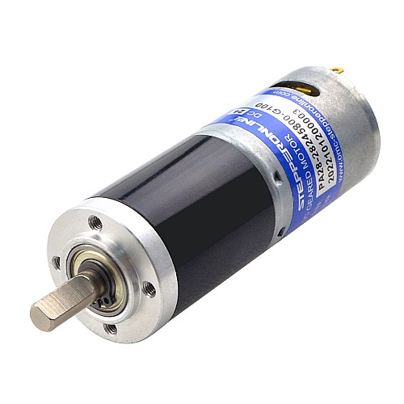  

## Specifications

This motor's specifications are as follows:  
Motor Size: Φ27.7 x 38mm  
Gearbox Size: Φ28 x 36.6mm  
Shaft Diameter: Φ6mm  
Shaft Length: 18mm  
D-cut Length: 12mm  

The bracket will need to handle 3.6Kg.cm

The maximum deflection is 0.3mm

### ABS

I chose to use ABS as the material. It has a Yield Strength of 29.6 MPa and a Young's Modulus of 1.79 GPa.

## Feature 1
Below are my stress calculations for Feature 1 of the motor mount. I chose b to be 6mm because that much of the shaft doesn't have a D-cut.
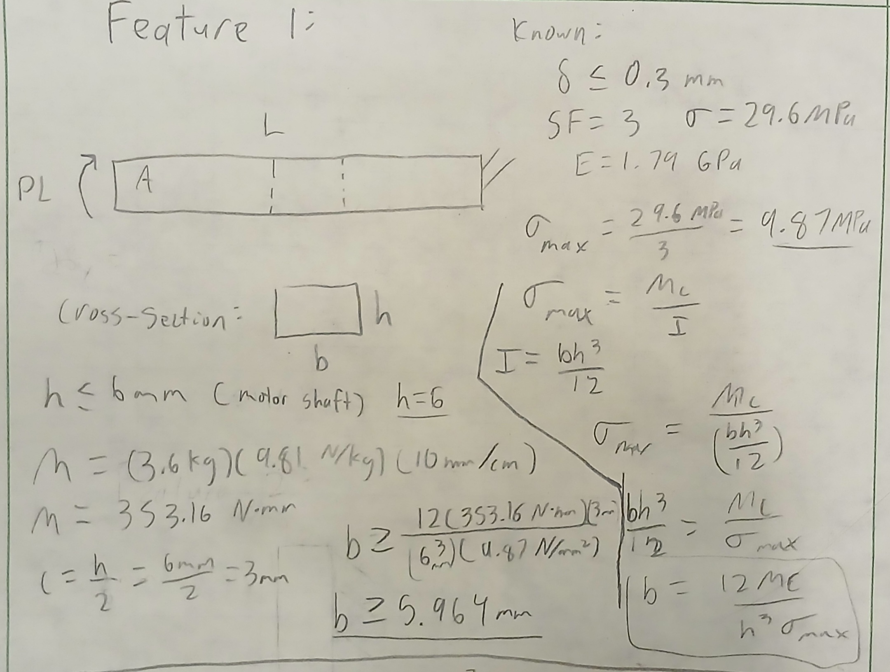  
These are my deflection calculations for Feature 1. I chose L to be 28mm in order to fit the motor.
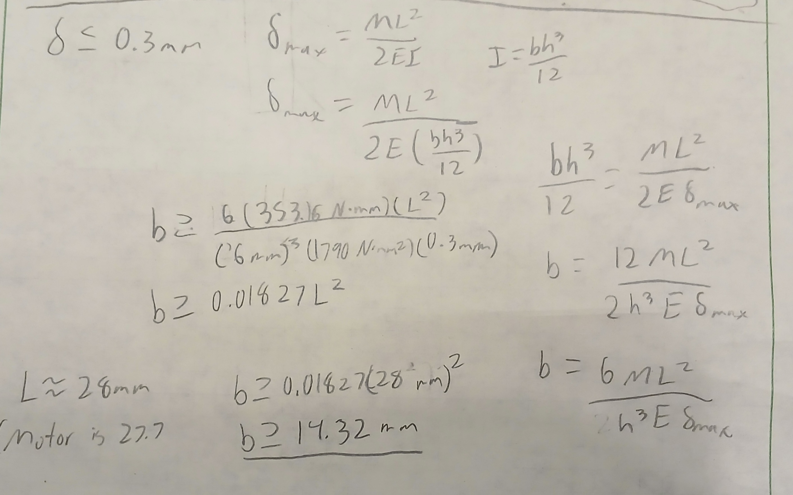  
I believe a good fit for b would 28mm, even though the mount could be thinner based on my calculations. This would prevent the motor tilting to the sides.

## Feature 2
Below are my stress calculations for Feature 2 of the motor mount.
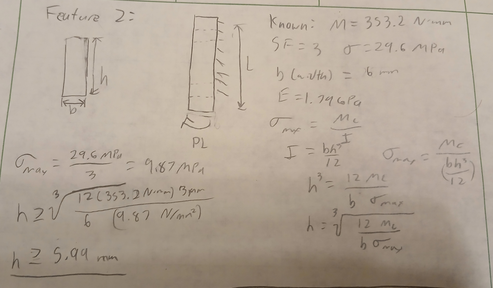  
These are my deflection calculations for Feature 2.
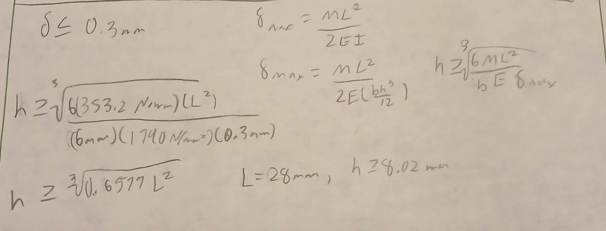  

## Designing the Mount
I first made a quick drawing for the motor mount.
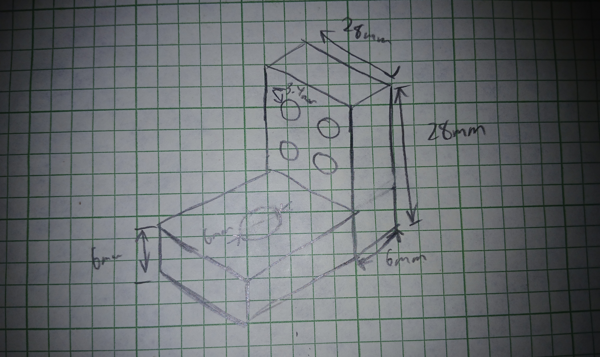  
This is modeling for the mount done in Creo. I started with feature 1.
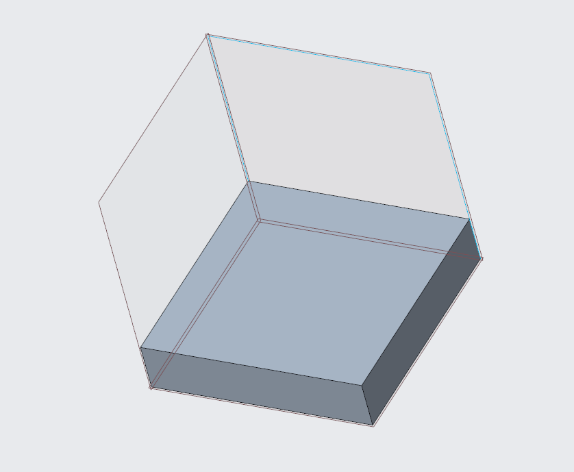  
I then made feature 2.
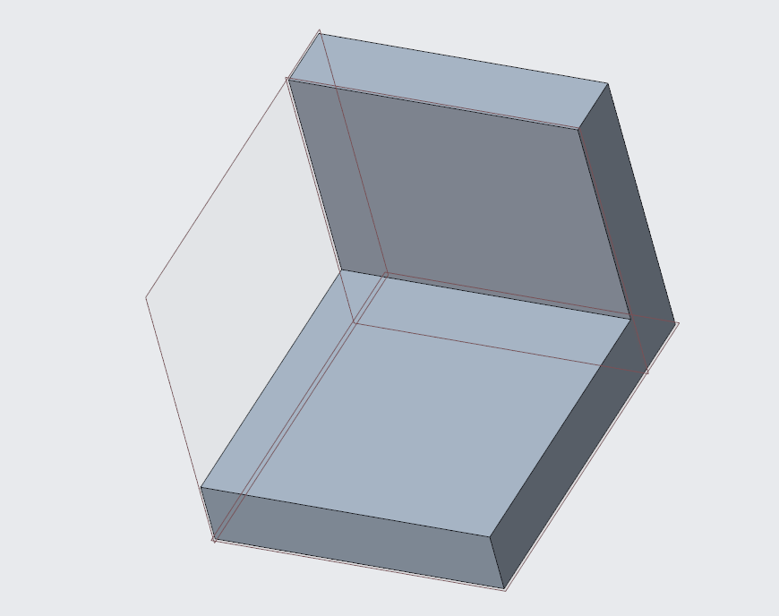  
I created a 6.05mm hole for the motor shaft, making it slightly larger for clearance.
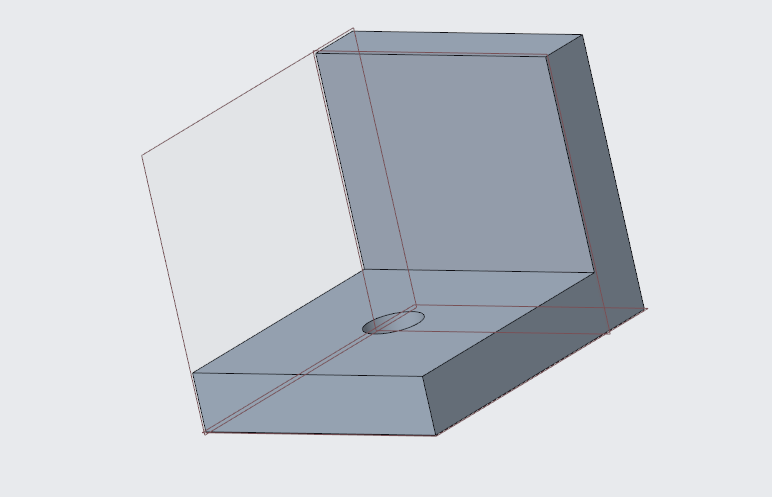  
I then added 4 3.4mm clearance holes evenly spaced on feature 2.
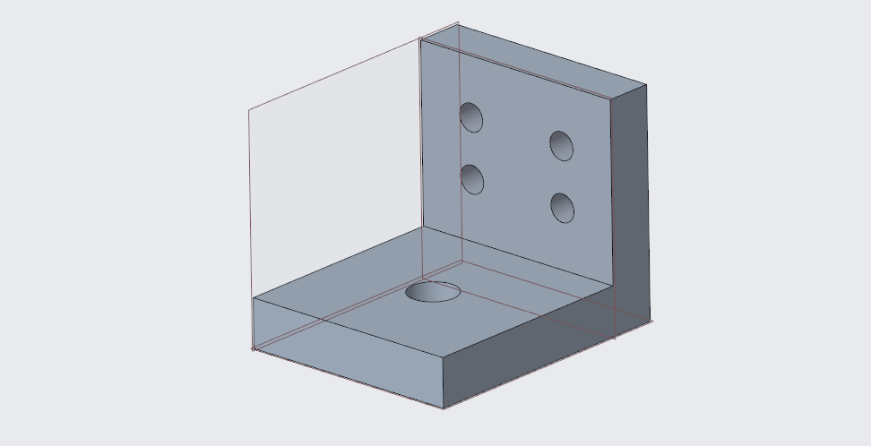  

Here is a link to the CAD file : )
## Drawing

This is the drawing I created for the part. I struggled with finding the template to add the material, my name, etc, so I inserted text manually.
)  

## Reflection
This project took around 4 hours to complete. The hardest part was the math for the deflection and stress. The modeling was easier but my design was simple.

## Appendix
Here are some motor mounts with a similar design.

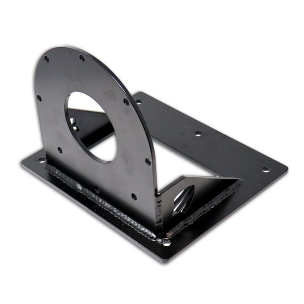  

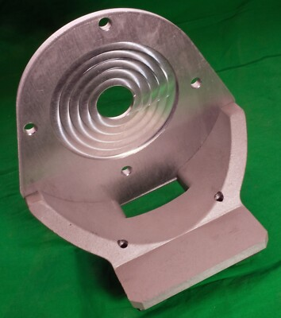  

