# A5 – Bracket Design
## Objective
In this project, I will be designing a bracket that fits around a T beam and holds a strap below the beam. 

### Specifications
My bracket design needs to have a safety factor of 4 and I'm choosing to have an applied load of 600lbf.
Below are the dimensions the bracket will be built around.

  
The bracket has a max deflection of 0.005 inches. I'm choosing to use ASTM A36 Steel in this design since it has the largest Young's modulus out of my choices and will require less material to meet deflection requirements. The Young's modulus for ASTM A36 Steel is 29,000 ksi and its yield strength is 36 ksi.

## Design

To determine the bracket dimensions, I have to do a stress analysis and then an elongation analysis for each section. The parts were already sections off as shown below.

### Stress Analysis
Every stress analysis assumes the force is 600lbf, there is a safety factor of 4, the bracket is 2 inches long, and the yield strength of the material is 36,000 psi.

Part A of the stress analysis involved determining the radius of the cylinder that holds a weighted strap. The radius must be greater than or equal to 0.5537 inches.
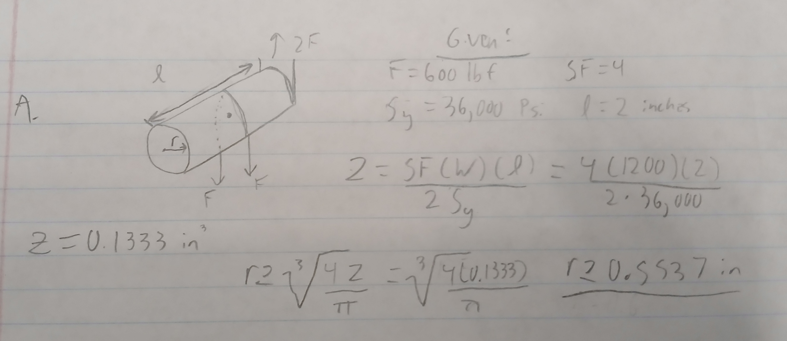  

I found the required area for part B, but actual dimensions will be calculated later. It must be greater than or equal to 0.1333 square inches.
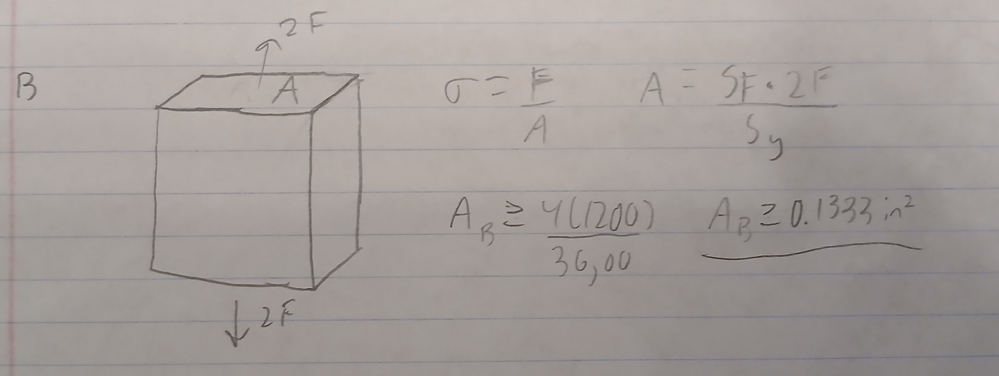  

Feature C was treated as a simple supported beam. With a given width and length, I solved for height. This feature has to be at least 0.4996 inches tall.
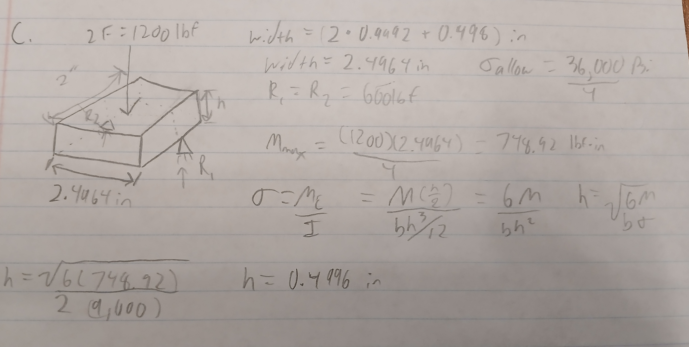  

Feature D was treated as if it was in compression.  I solved for width and it had to be greater than or equal to 0.0333 inches.
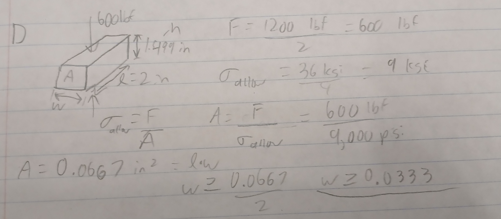  

Feature E was treated as if it was in compression. I solved for height and it must be greater than or equal to 0.0667 inches.
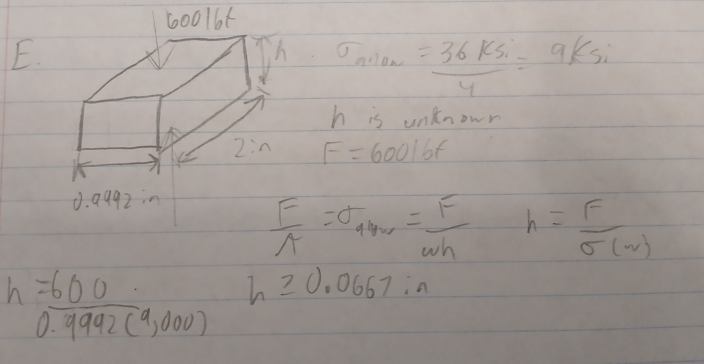  

### Elongation Analysis
I continued the analysis by determining the minimum dimensions required to keep deflection below 0.005 inches. ASTM A36 steel has an elastic modulus of 29,000,000 psi.

Feature A was treated as a cantilever beam. I solved for the minimum radius needed to keep deflection below 0.005 inches. The radius must be greater than or equal to 0.409 inches.
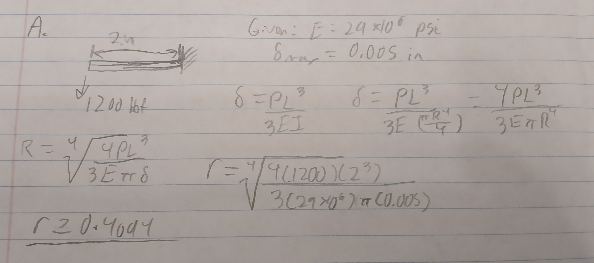  

Feature B was treated as an axially loaded bar. I solved for the minimum cross-sectional area required to keep elongation below 0.005 inches.
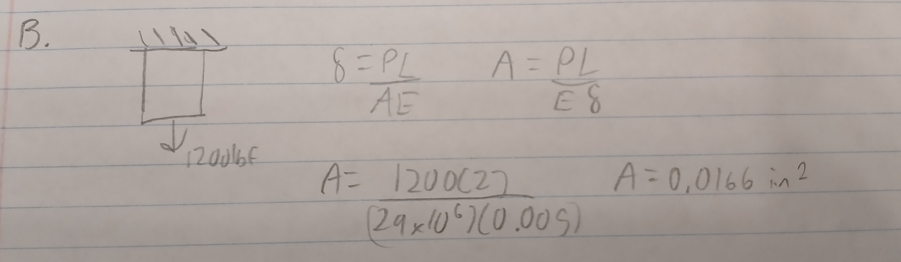  

Feature C was treated as a simply supported beam with a concentrated load at the center. With the given width and length, I solved for height. The height must be greater than or equal to 0.252 inches.
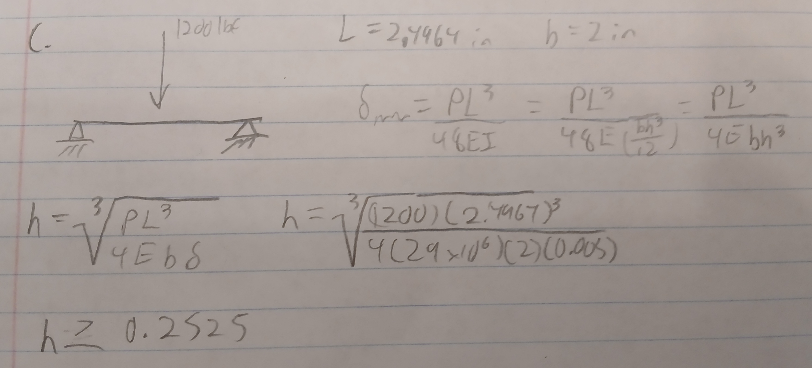  

Feature D was treated as an axially loaded member in compression. I solved for the minimum cross-sectional area required to keep deformation below 0.005 inches. The required area is 0.00620 square inches.
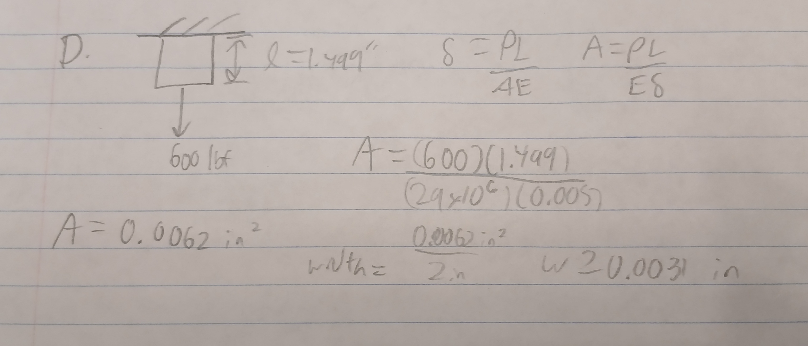  

Feature E was treated as an axially loaded member in compression. With a width of 0.9992 inches and length of 2 inches, I solved for height. The height must be greater than or equal to 0.00828 inches.
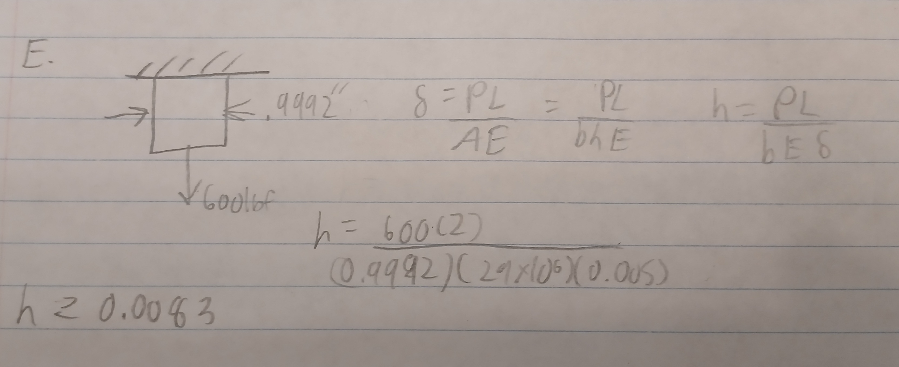  

## Design

The first multiview sketch shows the dimensions determined from the stiffness analysis. These dimensions represent the minimum sizes needed to keep deflection below 0.005 inches.
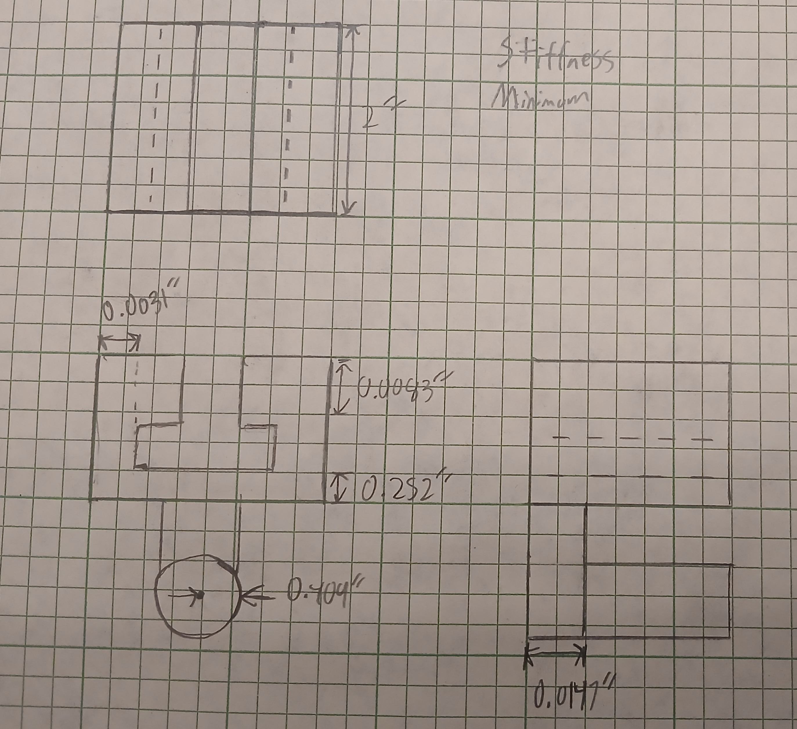  

The second multiview sketch shows the dimensions determined from the stress analysis. These dimensions account for the safety factor of 4 and keep the stresses below the allowable stress of the material.
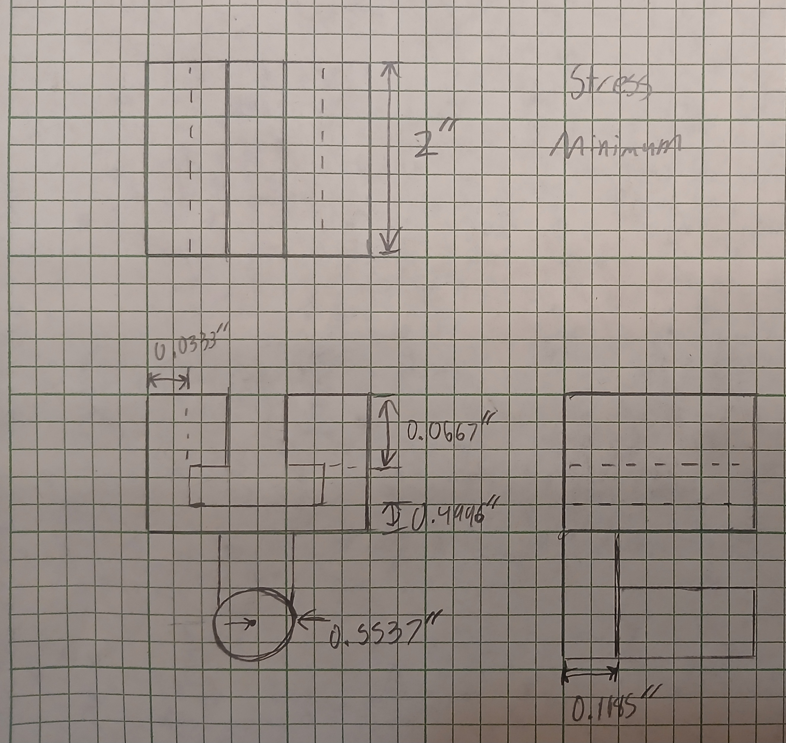  

### Failure Mode
Stress governed the final dimensions for most of the features. For example, Feature C required a height of 0.4996 inches from the stress analysis, while the stiffness analysis only required 0.252 inches. Because the stress requirement was larger, the final height of Feature C was based on stress.

### Error Propagation
Values calculated for earlier features were used in the analysis of later features. The load carried by Feature A was transferred through Feature B and then used to determine the reactions in Feature C. An incorrect force in an earlier calculation would therefore cause the dimensions of the later features to also be incorrect. Checking the FBD and force equilibrium for each feature helped prevent this. The design being symmetrical allowed the force transfer to be calculated easier.

### Assumption Sensitivity
One important assumption was the material choice of ASTM A36 steel. The calculations used a yield strength of 36,000 psi and an elastic modulus of 29,000,000 psi. If a material with a different yield strength or elastic modulus was used, the required dimensions would change. A lower yield strength would require larger dimensions for the stress analysis, while a lower elastic modulus would require larger dimensions to meet the deflection requirement.

## Link Design

I determined the link area required based on the axial stress.
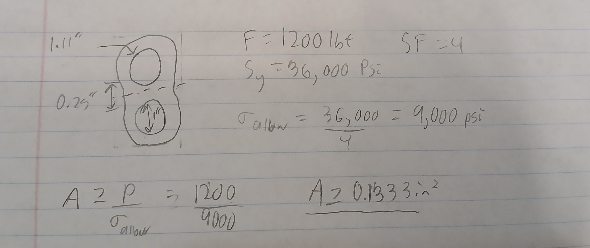  

I then determined the elongation of the link.
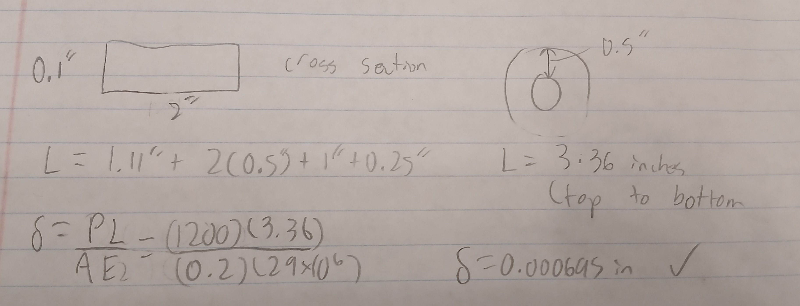  

### Sliding Fit
I selected an RC2 sliding fit because the linkage needs to slide onto Feature A without freely rotating. Machinery’s Handbook, page 651, describes RC2 as allowing parts to move and turn easily. Using Table 8a on page 654, the 1.125-inch nominal size gives a 1.1250–1.1255 in hole and 1.1243–1.1247 in shaft.

### Force Fit
I selected an FN1 force fit because the shaft requires light assembly pressure. Using Table 11 and the 0.95–1.19 inch size range, the hole is 1.0000–1.0005 in and the shaft is 1.0008–1.0012 in, giving 0.0003–0.0012 in interference.

Below are the tables for fits from the Machinery's Handbook.
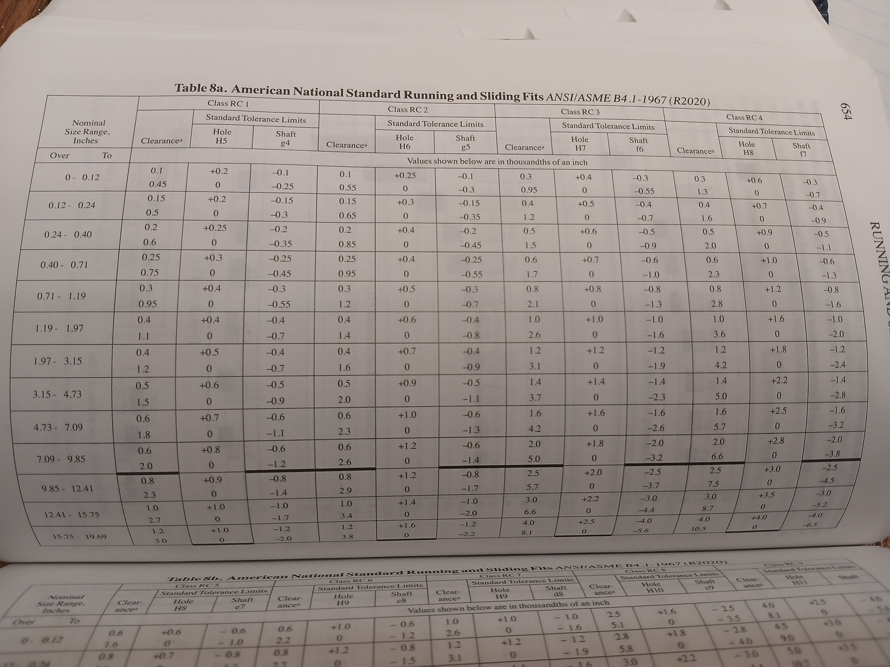
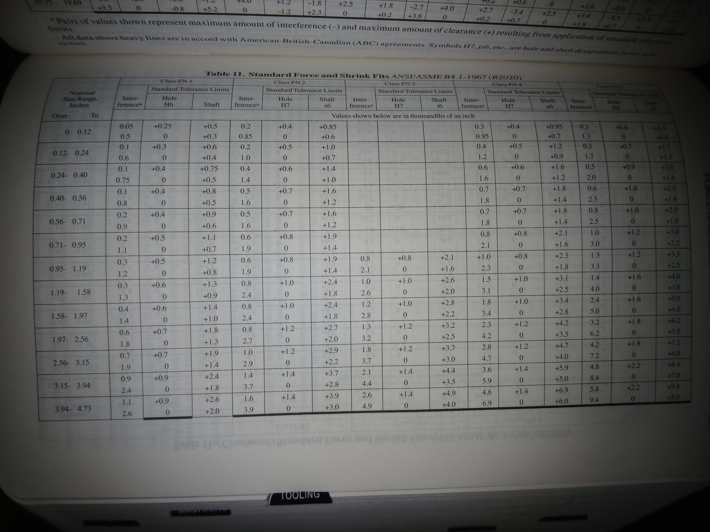

## Conclusion
Overall, I successfully designed the bracket and linkage to meet the required stress, deflection requirements. The entire design and analysis process took around 4 hours to complete.
