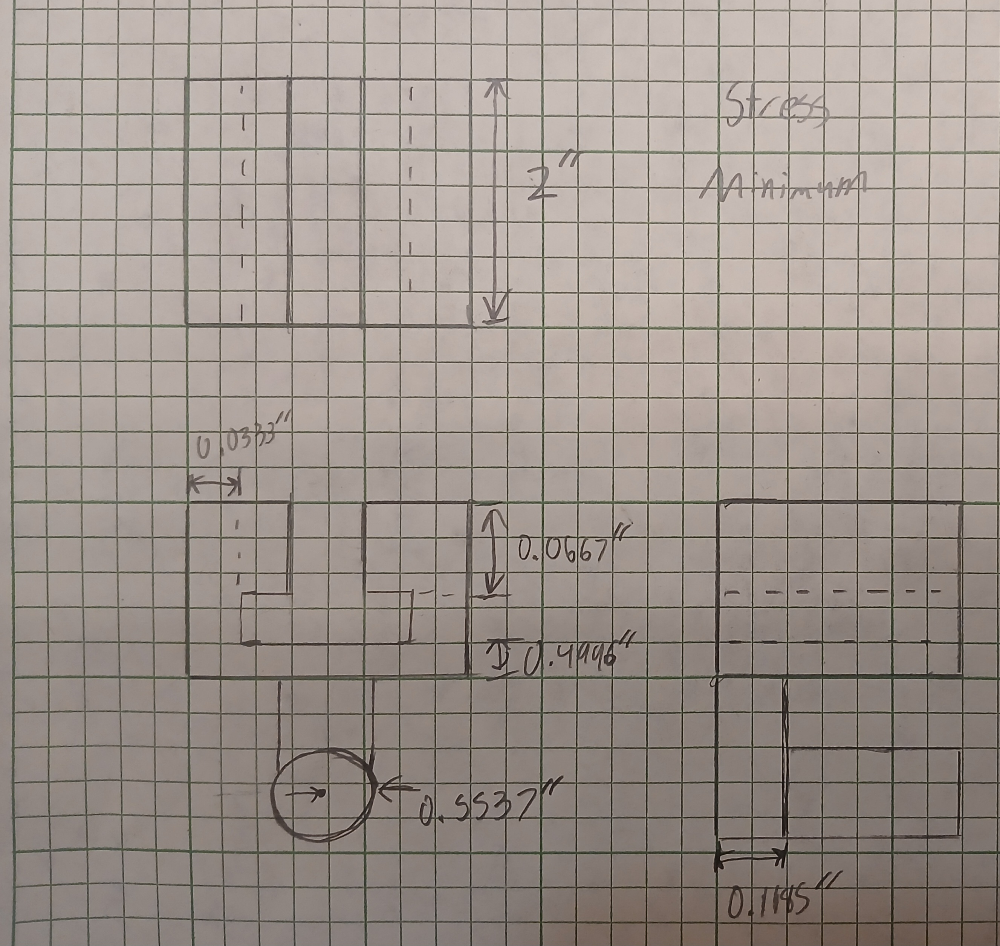
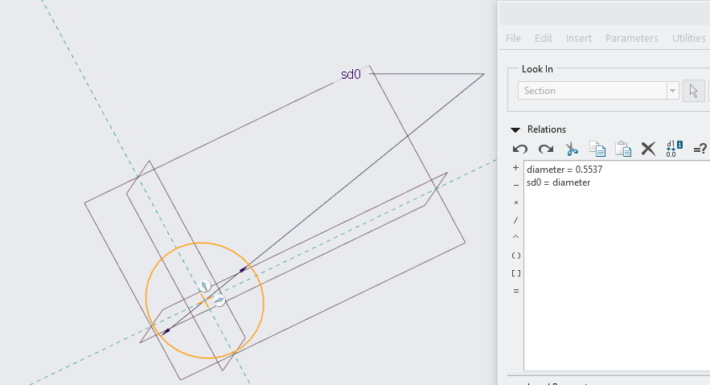
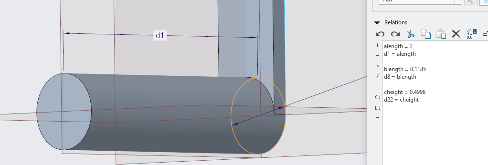
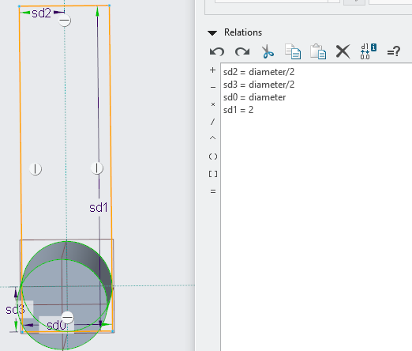
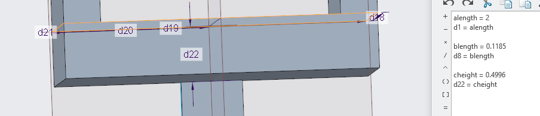
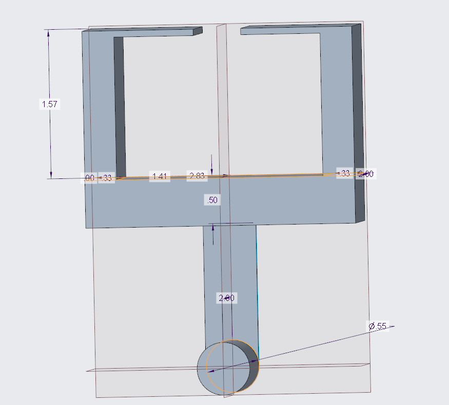

# A6 - Bracket Drawing

## Objective

This project entails creating a parametric model of the previously designed bracket and creating a fully dimensioned engineering drawing.

## Analyze

The bracket from the previous assignment was designed using strength and stiffness calculations to determine the necessary dimensions. These dimensions will now be used to create the parametric CAD model.

  

The bracket also needs to properly fit over the given T-beam. The dimensions and tolerances of the T-beam are shown below.

  

## Decide

### Parametric Model

The bracket was modeled in Creo using parameters for the important dimensions. This allows dimensions to change based on the equations used to design the bracket.

  

  

  

  

  

### Drawing

A multiview drawing was created using third-angle projection.

[Drawing Image]

The sliding surfaces use tighter tolerances because they need to properly fit over the T-beam. Less important dimensions use looser tolerances because they do not directly affect the fit of the bracket.

### Mistakes

[Briefly explain any mistake/change you made while modeling.]

## Communicate

The final design uses parameters to control the important dimensions of the bracket. A fully dimensioned drawing was also created so that the bracket could be manufactured with the required fits.

### Lessons Learned

This project showed how parameters can be used to connect engineering calculations directly to a CAD model. I also learned how different tolerances can be used depending on how important a dimension is to the function of the part.

### Time Spent

The project took approximately ___ hours to complete.

### CAD Files

[Bracket CAD Files](LINK)
